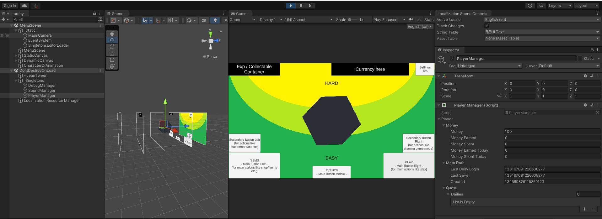
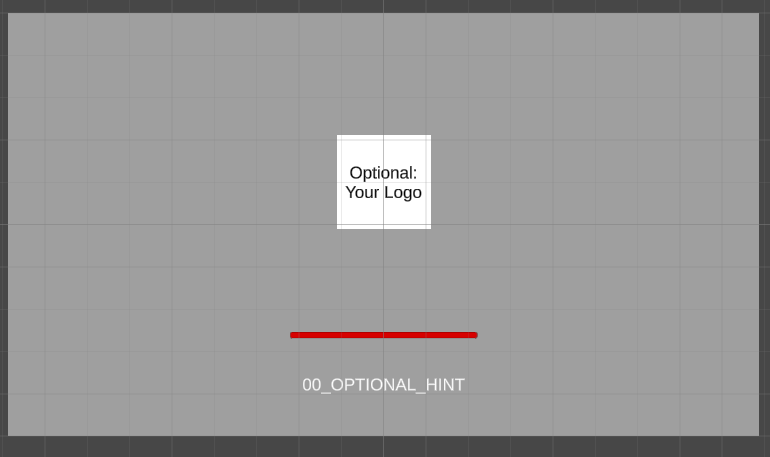
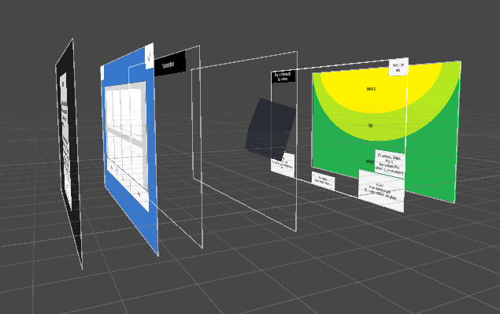
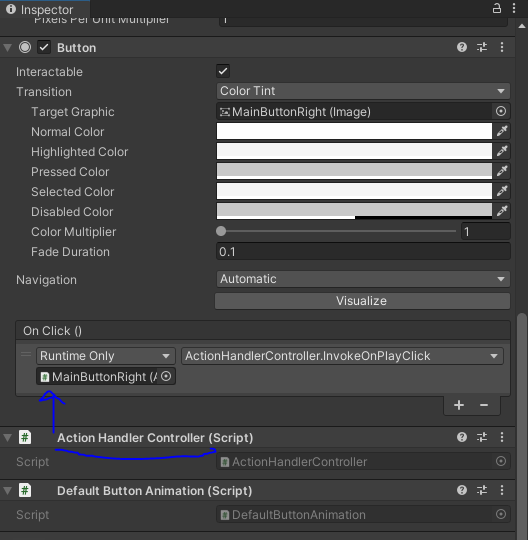
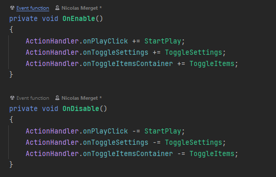

# Unity Fast Track

Unity Fast Rack is a template project for games. 🎮

It provides a good starting point and some explanations how to manage some basics.

Feel free to clone the repo and test it with Unity.

Here is an example how the main menu looks like:

Why is this so ugly? It doesn't look like a game?! 😲

This template is just a minimum example how a project could be managed. 

See the [Details](#details) section for more information.

## Core Concepts

  
<strong>Singletons</strong>

Use singletons for unique classes which are used by multiple scenes or other scripts.

For example if you want to use and control sound you can use a singleton for this.
Sound files can be very large for loading on a mobile device.
The singleton provides a way to load the files in a loading screen and reuse the same class everywhere.
For a good experience you should load most async stuff in a loading screen and not during the game.

How to use it in the code?

As an example look at ``Scripts/Utils/DebugManager`` or ``Scripts/Utils/Sound/SoundManager``.
The script extends the Singleton Class, which provides the an interface for loading and providing functions and
parameters for other classes.

If you create a new Manager-Class add it to the ``Scripts/Singleton/SingletonsLoader`` and in Unity create a new Empty
and add it to ``Prefabs/Utils/_Singletons``.
The new Manager will be automatically loaded in the ``LoadingScene`` and you can access it everywhere
with ``Debug.Log(DebugManager.instance.debug)``.

  
<strong>ActionHandler</strong>

You can find the ActionHandler under  ``Scripts/Utils/ActionHandler.cs``.
Purpose of this is to bundle all possible events for the game in one file.

Why should I want to do this?

Try to separate UI and other interactions with logic!

If you use Unity you come to a point where you add a lot of scripts which should handle UI and do some calculation and
also a request to a backend.
At the end you drag & drop scripts from one game object to another, losing the overview in the hierarchy.

For a clean code just use the ``Scripts/Utils/ActionHandlerController.cs`` for buttons/ interactions and invoke an event.

In your scene all you have to do is to add a Controller-Script to an empty object and subscribe to the event
in `` private void OnEnable()``.
With this you can keep your logic in one place and you don't have to search in your hierarchy for it.

## Dependencies

1. [TextMesh Pro](https://docs.unity3d.com/Manual/com.unity.textmeshpro.html): Obvious pick for better text ui 📃
2. [Localization](https://docs.unity3d.com/Packages/com.unity.localization@1.0/manual/index.html): Unity provides this
   🏳‍🌈
3. [AsyncAwaitUtil](https://assetstore.unity.com/packages/tools/integration/async-await-support-101056): [Coroutines](https://docs.unity3d.com/Manual/Coroutines.html)
   suck🤮, async await is easy 🤯
4. [LeanTween](https://assetstore.unity.com/packages/tools/animation/leantween-3595): Simple tweening library for ui
   animations ⬆🏃‍♂️

## Structure

  
<strong>Editor</strong>

Some scripts which should run in the unity editor in the background:

- DependencyCheck: Will look for all required dependencies
- ActionHandlerGenerator: Will generate a controller to trigger events from game objects

  
<strong>Localization</strong>

All assets and strings which should be translated.

  
<strong>Plugins</strong>

All Dependencies should be moved into this to separate them from your code.

  
<strong>Prefabs</strong>

Predefined game objects to bundle or reuse.

  
<strong>Resources</strong>

All files like materials, images, music etc.

  
<strong>Scenes</strong>

All your scenes for your game.

  
<strong>Scripts</strong>

All code you write.

## Details

### UX

A lot of suggestions here are for mobile devices first. Why?

Because it is easy to scale UI Elements for a larger device or to enable a controller.
But it is harder to convert a PC game to a mobile game if you don't have those suggestions in mind.

#### LoadingScene

Try to add a loading screen as your first scene. Why?

Some assets like music can be loaded here. Or async calls to a backend to fetch the user-data.

Users don't like to wait for a loading process during the game. But it is okay to have a loading screen before the game starts.

Keep that in mind. If there is no chance to avoid a loading screen try to make it interactive.
A minimum would some loading indicator to show the progress. Moreover you can add some hints below this.
Another approach would be to add a minigame into the loading screen, like pressing a button to make push-ups with your character.

#### MenuScene

For your UI make sure to follow this layout principle:

What is this?

Those a areas for a mobile device which the average user can reach:

- Yellow (Hard): Place non interactive elements here like the users lvl etc.
- Light Green (Okay): Place buttons here which are optional like settings etc.
- Green (Easy): Place your main buttons here like 'play' or 'shop'.

---

Canvas layers:

Try to use different layers with sorting layers or z-index relative to the camera.

In the example we can merge 3d and 2d together to animate the cube.

In a real game you can place the main character or some other 3d models here. 
The user sees his progress if the character wears new equipment.
If you don't have a main character, you can show the last bought item etc.

---

Dialogs and Popups

Try to avoid a button with a "X" to close the dialog, because users clicks on them faster then on a "close" button.

If you show a Dialog ("rate-app" or "watch-ad to continue") the close button should be on the left and the positive button ("buy","rate",...) should be on the right.

### Coding

#### Events

The ``ActionHandlerController`` will be generated automatically. You can add it to invoke events from a game object like a button.
Add the ``ActionHandlerController`` to the game object containing the button and map it to the ``OnClick``. 
Afterwards you can select the function corresponding with the event.

Create a new empty game object and attach a script to it for example ``GameSceneController``.
In your controller you can subscribe to events in the ``OnEnable`` function and unsubscribe in ``OnDisable``.
The functions you add to the ``ActionHandler`` can be in the same controller or a service etc.

Try to keep the logic how your game works separate from your UI or interactions.

